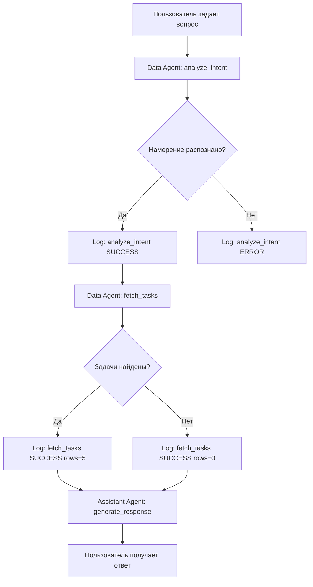

# Система логирования AI-агентов

## 📋 Обзор

Полная система мониторинга и отладки работы личного AI-помощника в CRM-системе.

### Возможности:
- ✅ Детальное логирование всех действий агентов
- ✅ Трассировка сессий (от вопроса до ответа)
- ✅ Мониторинг производительности (время выполнения)
- ✅ Отслеживание потребления токенов и стоимости
- ✅ Запись SQL-запросов и количества строк
- ✅ Логирование ошибок с полным контекстом
- ✅ Web-интерфейс с фильтрацией и поиском

---

## 🏗️ Архитектура

### 1. База данных: `agent_logs`

**Файл:** `create-agent-logs-table.sql`

**Поля:**
```sql
id              UUID PRIMARY KEY
user_id         UUID REFERENCES auth.users
session_id      TEXT  -- группировка действий в одну сессию
agent_type      TEXT  -- data_agent | crm_tools | assistant_agent
action_type     TEXT  -- analyze_intent | fetch_tasks | generate_response
input_data      JSONB -- входные данные (вопрос, фильтры)
output_data     JSONB -- результат (намерение, данные из БД)
sql_query       TEXT  -- выполненный SQL-запрос (если есть)
rows_affected   INT   -- количество найденных/измененных строк
execution_time_ms INT -- время выполнения в миллисекундах
status          TEXT  -- success | error | warning
error_message   TEXT  -- текст ошибки
model_used      TEXT  -- deepseek-chat | gpt-4o
tokens_used     INT   -- потраченные токены AI
created_at      TIMESTAMP
```

**RLS-политики:**
- Пользователи видят только свои логи
- Админы видят все логи
- Service role может записывать логи

**Индексы:**
- `user_id` — быстрый поиск по пользователю
- `session_id` — группировка действий
- `agent_type` — фильтрация по типу агента
- `created_at` — сортировка по времени

---

### 2. Backend: Утилиты логирования

#### `src/lib/agent-logger.ts`

**Функции:**

```typescript
// Запись лога в базу данных
async function logAgentAction(entry: AgentLogEntry): Promise<void>

// Начать замер времени выполнения
function startAgentLog() {
  const startTime = Date.now();
  const sessionId = generateSessionId();
  
  return {
    sessionId,
    finish: async (entry) => {
      await logAgentAction({
        ...entry,
        execution_time_ms: Date.now() - startTime,
        session_id: sessionId,
      });
    }
  };
}

// Консольное логирование для разработки
function consoleLog(type: string, message: string, data?: any)

// Генерация уникального ID сессии
function generateSessionId(): string
```

**Типы статусов:**
- `success` — операция выполнена успешно
- `error` — произошла ошибка
- `warning` — есть проблемы, но не критичные

---

### 3. Инструментированные агенты

#### `src/lib/data-agent.ts`

**Логируемые действия:**

1. **analyze_intent** — анализ намерения пользователя
   ```typescript
   const log = startAgentLog();
   const response = await openai.chat.completions.create({...});
   await log.finish({
     agent_type: 'data_agent',
     action_type: 'analyze_intent',
     input_data: { user_message: message },
     output_data: { intent },
     model_used: 'deepseek-chat',
     tokens_used: response.usage?.total_tokens,
     status: 'success',
   });
   ```

2. **fetch_tasks** — получение задач из БД
   ```typescript
   const log = startAgentLog();
   const tasks = await getUserTasks(userId, filters);
   await log.finish({
     agent_type: 'data_agent',
     action_type: 'fetch_tasks',
     input_data: { filters },
     output_data: { count: tasks.length },
     rows_affected: tasks.length,
     status: 'success',
   });
   ```

3. **fetch_projects** — получение проектов

4. **fetch_invoices** — получение счетов

**Консольные логи:**
```
🤖 Data Agent: Analyzing user intent...
   📥 Input: какие задачи на сегодня?

✅ Data Agent: Intent analyzed successfully
   📤 Output: { action_type: "get_tasks", filters: {...} }
   ⏱️  Execution time: 842ms
   🎯 Tokens used: 387

📊 Data Agent: Fetching tasks from database
   🔍 Filters: { date_range: "2024-01-15 - 2024-01-15" }
   ✅ Found 3 rows in 124ms
```

---

### 4. API: `/api/agent-logs`

**Файл:** `src/app/api/agent-logs/route.ts`

**Метод:** GET

**Query Parameters:**
```
agent_type     string?  // data_agent | crm_tools | assistant_agent
action_type    string?  // analyze_intent | fetch_tasks | etc
status         string?  // success | error | warning
session_id     string?  // ID сессии для трассировки
limit          number?  // default: 100
offset         number?  // default: 0
```

**Response:**
```json
{
  "logs": [
    {
      "id": "uuid",
      "user_id": "uuid",
      "session_id": "abc123...",
      "agent_type": "data_agent",
      "action_type": "analyze_intent",
      "input_data": { "user_message": "какие задачи на сегодня?" },
      "output_data": { "intent": {...} },
      "execution_time_ms": 842,
      "status": "success",
      "model_used": "deepseek-chat",
      "tokens_used": 387,
      "created_at": "2024-01-15T10:30:00Z"
    }
  ],
  "total": 42,
  "limit": 100,
  "offset": 0
}
```

**Аутентификация:**
- Bearer token в заголовке Authorization
- RLS автоматически фильтрует по user_id

---

### 5. Frontend: Страница логов

**Файл:** `src/app/logs/page.tsx`

**URL:** https://alu.stella-spb.ru/logs

**Функции:**

1. **Список логов с карточками**
   - Компактный вид: статус, агент, действие, время
   - Раскрывающиеся детали: input/output данные, SQL-запросы, ошибки

2. **Фильтры**
   - По типу агента (Data Agent / CRM Tools / Assistant Agent)
   - По типу действия (analyze_intent / fetch_tasks / ...)
   - По статусу (Успех / Ошибка / Предупреждение)
   - По ID сессии (для трассировки)

3. **Индикаторы**
   - ✅ Зеленая галочка — success
   - ❌ Красный крестик — error
   - ⚠️  Желтый треугольник — warning
   - 🧠 Синий мозг — Data Agent
   - 🗄️ Фиолетовая БД — CRM Tools
   - 🔧 Зеленый ключ — Assistant Agent

4. **Детали лога (при раскрытии)**
   - 📥 Входные данные (JSON)
   - 📤 Выходные данные (JSON)
   - 🗄️ SQL-запрос (с подсветкой синтаксиса)
   - ❌ Ошибка (если есть)
   - 🤖 Модель AI
   - 🎯 Токены использованы
   - ⏱️ Время выполнения

---

## 🔄 Жизненный цикл запроса

### Пример: "какие задачи на сегодня?"



**Логи в таблице:**

| ID | Session | Agent | Action | Time | Rows | Status |
|----|---------|-------|--------|------|------|--------|
| 1  | abc123  | data_agent | analyze_intent | 842ms | - | ✅ success |
| 2  | abc123  | data_agent | fetch_tasks | 124ms | 5 | ✅ success |
| 3  | abc123  | assistant_agent | generate_response | 1.2s | - | ✅ success |

---

## 🐛 Отладка с помощью логов

### Проблема: "На сегодня задач не найдено"

**Шаг 1:** Открыть /logs, найти последнюю сессию

**Шаг 2:** Проверить `analyze_intent`:
```json
{
  "input_data": { "user_message": "какие задачи на сегодня?" },
  "output_data": {
    "action_type": "get_tasks",
    "filters": {
      "date_range": "2024-01-15 - 2024-01-15",
      "assigned_to": "user_uuid"
    }
  },
  "status": "success"
}
```
✅ Намерение распознано правильно

**Шаг 3:** Проверить `fetch_tasks`:
```json
{
  "input_data": {
    "filters": {
      "date_range": "2024-01-15 - 2024-01-15",
      "assigned_to": "user_uuid"
    }
  },
  "output_data": { "tasks": [] },
  "rows_affected": 0,
  "status": "success"
}
```
❌ База данных вернула 0 строк

**Шаг 4:** Проверить причину:

1. **Нет задач на сегодня?**
   ```sql
   SELECT * FROM tasks 
   WHERE assigned_to = 'user_uuid' 
   AND due_date = '2024-01-15';
   ```

2. **Неправильный date_range?**
   - Ожидаем: `2024-01-15 - 2024-01-15`
   - Получили: `2024-01-14 - 2024-01-14`
   - Проблема в парсинге "сегодня"

3. **RLS блокирует?**
   ```sql
   SET ROLE authenticated;
   SELECT * FROM tasks WHERE assigned_to = auth.uid();
   ```

---

## 📊 Метрики и аналитика

### Производительность:

```sql
-- Средняя скорость анализа намерений
SELECT 
  AVG(execution_time_ms) as avg_ms,
  MAX(execution_time_ms) as max_ms
FROM agent_logs
WHERE action_type = 'analyze_intent'
AND created_at > NOW() - INTERVAL '7 days';
```

### Стоимость AI:

```sql
-- Общее потребление токенов за месяц
SELECT 
  SUM(tokens_used) as total_tokens,
  COUNT(*) as requests,
  model_used
FROM agent_logs
WHERE created_at > NOW() - INTERVAL '30 days'
GROUP BY model_used;
```

**Расчет стоимости:**
- DeepSeek: $0.28 / 1M input tokens, $0.42 / 1M output tokens
- GPT-4o: $5.00 / 1M input tokens, $15.00 / 1M output tokens

### Популярные запросы:

```sql
-- Топ-10 намерений пользователей
SELECT 
  output_data->>'action_type' as intent,
  COUNT(*) as count
FROM agent_logs
WHERE action_type = 'analyze_intent'
GROUP BY intent
ORDER BY count DESC
LIMIT 10;
```

---

## 🚀 Будущие улучшения

### 1. Dashboard с графиками
- Chart.js для визуализации метрик
- График использования по часам/дням
- Распределение по типам агентов

### 2. Real-time мониторинг
- WebSocket для live обновлений
- Алерты при ошибках
- Счетчик активных сессий

### 3. Экспорт логов
- CSV export для анализа
- JSON export для бэкапа
- Интеграция с Elasticsearch

### 4. AI-powered анализ
- Автоматическое обнаружение паттернов ошибок
- Рекомендации по оптимизации
- Предсказание нагрузки

---

## 📚 Документация

- **AGENT-LOGGING-TEST.md** — инструкция по тестированию
- **create-agent-logs-table.sql** — SQL-схема таблицы
- **src/lib/agent-logger.ts** — API документация в JSDoc

---

## ✅ Итоговый чеклист

Перед деплоем в production:

- [ ] Выполнить `create-agent-logs-table.sql` в Supabase
- [ ] Проверить RLS-политики (пользователи видят только свои логи)
- [ ] Протестировать запись логов локально
- [ ] Проверить фильтрацию на странице /logs
- [ ] Убедиться, что session_id связывает действия
- [ ] Проверить производительность (индексы работают?)
- [ ] Настроить ротацию логов (удаление старых записей?)
- [ ] Добавить мониторинг размера таблицы

---

**Статус:** ✅ Готово к локальному тестированию  
**Следующий шаг:** Выполнить инструкции из AGENT-LOGGING-TEST.md
